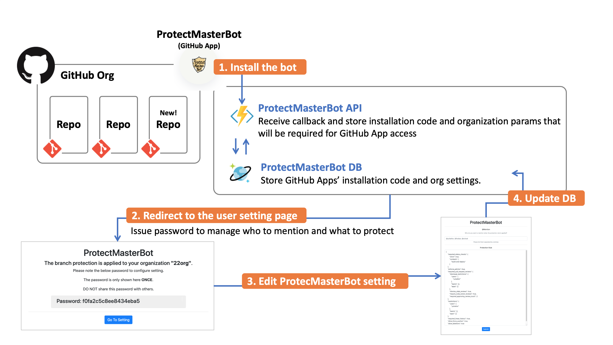
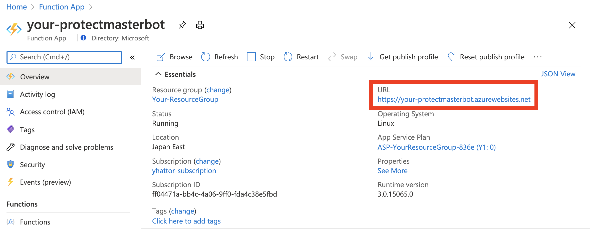

# ProtectMasterBot  :octocat:


ProtectMasterBot is a GitHub App that enables you to protect your default branch.
To prevent commits from being lost due to accidental force pushes, you should protect your branch.
However, it's very hard to apply protection rules every single time right after your organization member creates a repository. This bot automates the process to apply the rule and inform you about the protection rules applied to the repository.

It's very easy to use ProtectMasterBot. Please install the bot in your organization.
Please Access **[HERE](https://github.com/apps/protectmasterbot)** to get the bot!

[](https://github.com/apps/protectmasterbot)
## How to use


---
## Architecture and process
### Process to protect master/main branch.
1. When your organization member creates a new repository in the organization, ProtectMasterBot streams the repository's "created" event.
2. Azure Functions trigger ProtectMasterBot API. (```POST: /api/ProtectMaster```)
3. ProtectMasterBot API initiates the repository with README.md. The default branch is also created at the same time. 
4. ProtectMasterBot API protects the default branch. ProtectMasterBot supports both master and main as the default branch.
5. ProtectMasterBot API creates an issue in the repository. It also mentions a specific user.


### Process to register application
1. When the bot is installed, registration callback api on Azure Functions is called. (```GET: /api/ReceiveInstallation```)
2. The api registers organization and installation ID. After registration, the api provide a password to manage the servie setting.
3. User can edit ProtectMasterBot setting by accessing the edit page.(```GET: /api/EditRule```)
4. The API updates the CosmosDB.(```POST: /api/UpdateRule```)



---

## Host ProtectMasterBot by yourself

If you want to deploy ProtectMasterBot, you will need an Azure environment.
ProtectMasterBot will be hosted on Azure Functions and also connect to Azure CosmosDB.
Deployment can be done by GitHub Actions.
### Prerequisites
- Your GitHub Apps
- Azure Functions
- Azure CosmosDB


### How to deploy API on Azure.

### Create Azure Functions
1. Open portal.azure.com and create Azure FunctionApp.

2. **Fill in the form with parameters.**
Note: You need to fill in the form with the below specific parameters while creating.


Input |Parameters
---|-----
Publish | **code**
Runtime stack| **Python**
Version | **3.8**

3.  **Deploy Azure Functions** 


4.  **Download and memo the your-protectmasterbot.PublishSettings file** 


Please refer to the below link to get the publishing profile (*.pubxml) 
https://docs.microsoft.com/en-us/visualstudio/deployment/tutorial-import-publish-settings-azure?view=vs-2019
You will use it for CI/CD

5.  **Memo the URL of Azure Functions** 

You will use it for GitHub Apps setting


Please refer to the below link for more information about Azure Functions creation.
https://docs.microsoft.com/en-us/azure/azure-functions/functions-create-first-azure-function


### Create CosmosDB
1. **Open portal.azure.com and create CosmosDB.**


2. **Fill in the form with parameters.**


3.  **Deploy Azure CosmosDB** 


Input |Parameters
---|-----
API | Core (SQL)

4.  **Memo your primary key of CosmosDB** 


Please refer to the below link for Azure CosmosDB deployment.
https://docs.microsoft.com/en-us/azure/cosmos-db/how-to-manage-database-account
Note: You need to fill in the form with the below specific parameters while creating.

### Set Secret for CI/CD on your GitHub repository
1. Go to YOUR github repository of ProtectMasterBot which you forked or cloned. 
2. Then go to Settings > Secrets and add your Respository secrets named "AZURE_FUNCTIONAPP_PUBLISH_PROFILE"
3. Set your publishingProfile value of Azure Functions.


Please refer to the below link to set the secret for CI/CD
https://docs.github.com/en/free-pro-team@latest/actions/reference/encrypted-secrets
You need to add the below secret

Secret Name|Value
---|-----
AZURE_FUNCTIONAPP_PUBLISH_PROFILE| Your downloaded publishing profile.

### Setup your GitHub Apps
It's time to setup the GitHub Apps 
1. Go to your Settings > Developer settings > GitHub Apps
2. Then create your GitHub App.

Please fill in the form with the below parameter.

**General Settings**

Input|Value
---|---
GitHub App name | Your App Name
Homepage URL | Your Home page URL
Homepage URL | Your Home page URL
User authorization callback URL | https://<YOUR AZURE FUNCTIONS URL>.azurewebsites.net/api/ReceiveInstallation
Webhook | active
Webhook URL| https://<YOUR_AZURE_FUNCTIONS_NAME>.azurewebsites.net/api/ProtectMaster

**Permissions**

Permissions|Value|Detail
---|---|---
Administration | Read & Write | This permission is necessary to apply branch protection rule
Contents | Read & Write | This permission is necessary to initiate repository with README.md
Issues | Read & Write | This permission is necessary to create an issue

**Events**

Subscribe to events|Check
---|---
Repository| true

3. Confirm Creation

Please memo your App ID


4. Generate and Download GitHub Apps' PEM key
You will need PEM file and app ID for GitHub Apps beforehand.


Please refer to the below documents to get PEM file and App ID 
https://developer.github.com/apps/building-github-apps/authenticating-with-github-apps/

To learn more about GitHub Apps, please check below.
https://docs.github.com/ja/github-ae@latest/developers/apps/about-apps

### Setup Your Azure Function's Apps setting on Azure.
1. Configure the Azure Functions
You are almost there!
Finally, Go to Azure Functions > Configuration > Application settings, set the environmental variables and save the setting. 
You need to add the environment variables below


Key|Value
---|-----
gh_app_pem | your GitHub App's PEM string which must be encoded with Base64
gh_app_id | GitHub Apps ID
cosmosdb_connection_string | Your CosmosDB connection string 

Please refer to the below link for Azure Functions configuration
https://docs.microsoft.com/en-us/azure/azure-functions/functions-how-to-use-azure-function-app-settings

### Final Deployment 
Please run your CI/CD. If deployment is successfully done, then you are ready to use the bot! 

---
## How to run API in your local environment
You need to rename ```local.settings.json.sample``` as ```local.settings.json```, then set the values.
If you don't have a PEM file and GitHub Apps id, you need to create GitHub Apps first. Please refer to the documentation.
https://docs.github.com/ja/github-ae@latest/developers/apps/about-apps
Also, you need a CosmosDB environment beforehand. You can deploy it on Azure and you can also use the CosmosDB emulator for local development if you want.
https://docs.microsoft.com/en-us/azure/cosmos-db/local-emulator?tabs=cli%2Cssl-netstd21

### local.setting.json
```
"gh_app_pem": "<your pem string>",
"gh_app_id": "<your custom app id>",
"cosmosdb_connection_string": "<your CcosmosDBs connection string>"
```

### Run Function
```sh
pip install -r requirements.txt
func start
```